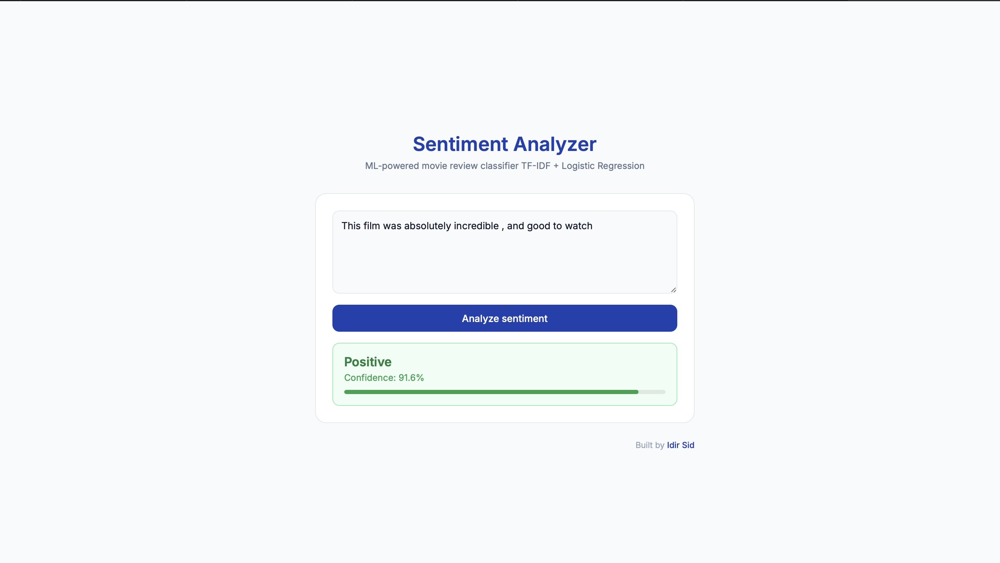

# Sentiment Analyzer

A full-stack machine learning web application that classifies movie reviews as **positive** or **negative** with a confidence score.

Built to demonstrate end-to-end ML deployment — from model training to a live web interface.

---

## Demo

> Type any English movie review and get an instant sentiment prediction with confidence score.



---

## Results

| Metric | Score |
|--------|-------|
| Accuracy | 90% |
| F1-Score (positive) | 0.90 |
| F1-Score (negative) | 0.90 |
| Training samples | 40,000 reviews |
| Test samples | 10,000 reviews |

---

## Architecture
User types review
↓
index.html (Frontend)
HTML / CSS / JavaScript
↓ fetch() POST /predict
main.py (Backend)
FastAPI server
↓ model.predict()
model.pkl (ML Model)
TF-IDF + Logistic Regression
↓
Returns JSON {label, confidence}
↓
Result displayed in browser
---

## Tech Stack

| Layer | Technology |
|-------|-----------|
| ML Model | scikit-learn — TF-IDF + Logistic Regression |
| Dataset | IMDB 50k Movie Reviews |
| Backend | FastAPI + Uvicorn |
| Frontend | HTML / CSS / JavaScript |
| Data cleaning | BeautifulSoup |

---

## Project Structure
sentiment-app/
├── train_model.py    # Model training script
├── main.py           # FastAPI backend server
├── index.html        # Frontend interface
├── .gitignore
└── README.md
---

## Getting Started

### 1. Clone the repository
```bash
git clone https://github.com/isidmohand-netizen/sentiment-analyzer.git
cd sentiment-analyzer
```

### 2. Install dependencies
```bash
pip install fastapi uvicorn scikit-learn joblib pandas beautifulsoup4
```

### 3. Download the dataset
Download [IMDB Dataset](https://www.kaggle.com/datasets/lakshmi25npathi/imdb-dataset-of-50k-movie-reviews) and place `IMDB Dataset.csv` in the project folder.

### 4. Train the model
```bash
python train_model.py
```

### 5. Start the backend server
```bash
uvicorn main:app --reload --port 8001
```

### 6. Open the frontend
```bash
open index.html
```

---

## Limitations

- Model trained on English reviews only — other languages not supported
- Best performance on movie/product review style text

---

## Author

**Idir Sid** — currently studying Machine Learning

[](https://github.com/isidmohand-netizen)